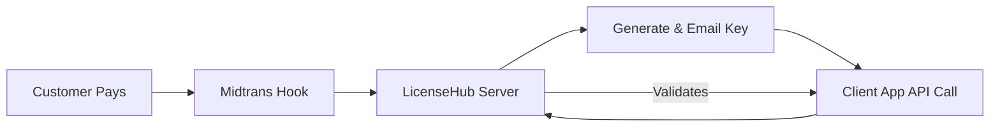

# 💎 LicenseHub Suite — Unified Full-Stack Ecosystem


<div align="center">

[](https://github.com/3flonet/licensehub-suite/stargazers)
[](https://github.com/3flonet/licensehub-suite/network/members)
[](https://github.com/3flonet/licensehub-suite/releases)
[](https://github.com/3flonet/licensehub-suite/actions/workflows/laravel-ci.yml)

<!-- Dynamic Stats from Server -->
[](https://github.com/3flonet/licensehub-suite)
[](https://github.com/3flonet/licensehub-suite)

</div>

**LicenseHub Suite** adalah ekosistem manajemen lisensi perangkat lunak kelas profesional (Unified Full-Stack Solution). Dirancang untuk skalabilitas tinggi, sistem ini memisahkan **Admin Command Center** (Laravel) dan **Premium Customer Portal** (React) namun tetap berjalan harmonis di bawah satu domain utama: `https://license.3flo.net`.

---

## 🏗 Struktur Proyek (Single Domain)

Sistem ini didesain agar mudah dideploy di cPanel/Shared Hosting dengan performa maksimal:
*   **[`/portal`](./portal)** (React 18+): Berjalan di root domain `/` menggunakan antarmuka Glassmorphism yang modern.
*   **[`/api`](./api)** (Laravel 11): Melayani jalur khusus `/admin`, `/api`, dan `/storage` melalui sistem Symlink.

---

## 🛰 Alur Kerja Sistem (How It Works)



1.  **Purchase**: Pelanggan memilih paket dan membayar melalui Midtrans di Portal React.
2.  **Automation**: Server menerima webhook, membuat key lisensi, dan mengirimnya via Email/WA melalui sistem Antrian (Queue).
3.  **Activation**: Software klien memvalidasi key ke endpoint API dengan `Product Secret`.
4.  **Monitoring**: Heartbeat (Ping) real-time memastikan lisensi tetap aktif dan sah di domain terdaftar.

---

## 💻 Panduan Pengembangan (Local)

Jalankan backend dan frontend menggunakan **Proxy** lokal agar sistem berjalan tanpa hambatan CORS.

### 1. Backend (Laravel)
```bash
cd api
composer install
php artisan key:generate
php artisan migrate --seed
php artisan serve # Default: http://localhost:8000
```

### 2. Frontend (React)
```bash
cd portal
npm install
npm run dev # Default: http://localhost:5173
```

---

## 🚀 Panduan Deployment (cPanel)

Panduan ini memungkinkan Anda menjalankan Laravel & React pada satu domain tanpa perlu modifikasi `index.php`.

### Langkah 1: Persiapan Folder di cPanel
Letakkan folder **`api`** di luar `public_html` (misal di `/home/user/licensehub-api`).
Folder publik Anda biasanya di `/home/user/public_html` atau `/home/user/license.3flo.net`.

### Langkah 2: Build & Upload React
Masuk ke folder `portal`, jalankan `npm run build`. Upload isi folder **`portal/dist/*`** ke folder publik domain Anda.

### Langkah 3: Membuat Symlink (Pintu Masuk Laravel)
Di terminal cPanel, jalankan perintah ini:
```bash
cd /home/user/license.3flo.net
ln -s /home/user/licensehub-api/public admin
ln -s /home/user/licensehub-api/public api
ln -s /home/user/licensehub-api/storage/app/public storage
```

---

## 🗺 Roadmap Masa Depan

- [x] Midtrans Automated Payment
- [x] Background Jobs (Email/WA Queue)
- [x] Client Domain Heartbeat API
- [x] GitHub CI/CD Actions Status
- [ ] Multi-Currency & Global Payments
- [ ] Developer SDK (PHP & JavaScript)
- [ ] Offline Activation Mode

---

## 🔐 Kredensial Admin (Default)

Setelah migrasi & seeder selesai:
*   **URL**: `https://license.3flo.net/admin`
*   **Email**: `admin@3flo.net`
*   **Password**: `admin123`

---

## 📄 Lisensi
Sistem ini menggunakan lisensi MIT License.

---

### Developed with ❤️ by **[3flo.Net Professional Team](https://3flo.net)**
