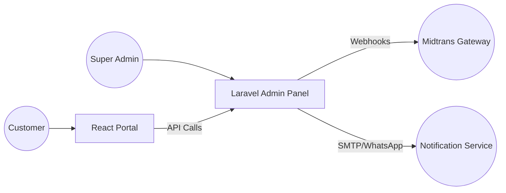

# 💎 LicenseHub Suite — Unified Full-Stack Ecosystem


[](https://github.com/3flonet/licensehub-suite)
[](./api)
[](./portal)
[](./api)

**LicenseHub Suite** is a high-end, production-ready software license management ecosystem. It bridges the gap between complex backend license logic and a premium user experience, providing a complete solution for software vendors to sell, manage, and verify licenses globally.

---

## 🏗 Project Architecture

The suite is divided into two specialized modules:

- **[`/api`](./api)**: The powerful engine built with **Laravel 11**. It handles the database, administrative command center (Filament), secure license generation, and payment settlement via Midtrans.
- **[`/portal`](./portal)**: The elegant face built with **React 18**. This is where customers manage their licenses, view activation keys, and process payments through a high-performance, mobile-first interface.



---

## 🔥 Key Ecosystem Features

- **Unified Dashboard**: Real-time sales data and activation metrics for administrators.
- **Hybrid Responsive Portal**: Mobile-first architecture that switches between table and card layouts for optimal UX.
- **Automated Settlement**: Instant license issuance upon successful payment via Midtrans.
- **Hardened Security**: Digital signature verification for license validation and secure API authentication.
- **Global Scalability**: Designed to handle thousands of licenses across different software products.

---

## 🚀 Combined Tech Stack

| Module | Core Technology | Highlights |
| :--- | :--- | :--- |
| **Backend** | **Laravel 11** | Filament v3, Reverb, MySQL, Midtrans SDK |
| **Frontend** | **React 18** | Tailwind CSS, Framer Motion, Zustand, Lucide |
| **Ops** | **PWA Ready** | Responsive Design, API Audit Logging, SEO Optimized |

---

## 🛠 Quick Start Guide

To get the entire ecosystem running on your machine:

### 1. Setup the API (Backend)
```bash
cd api
composer install
cp .env.example .env
php artisan key:generate
php artisan migrate --seed
php artisan serve
```

### 2. Setup the Portal (Frontend)
```bash
cd portal
npm install
cp .env.example .env.local
npm run dev
```

---

## 🔐 Administrative Access

After seeding the database, you can log in to the Unified Command Center:

- **URL**: `http://127.0.0.1:8000/admin`
- **Email**: `admin@3flo.net`
- **Password**: `admin123`

---

## 📄 Documentation
For more detailed technical info, please refer to:
- [Backend Documentation (`/api/README.md`)](./api/README.md)
- [API Integration Guide (`/api/INTEGRATION.md`)](./api/INTEGRATION.md)
- [Frontend Documentation (`/portal/README.md`)](./portal/README.md)

---

Developed with ❤️ by **3flo.Net Professional Team**
